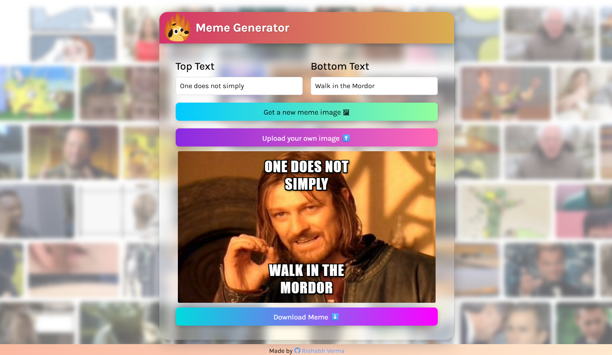
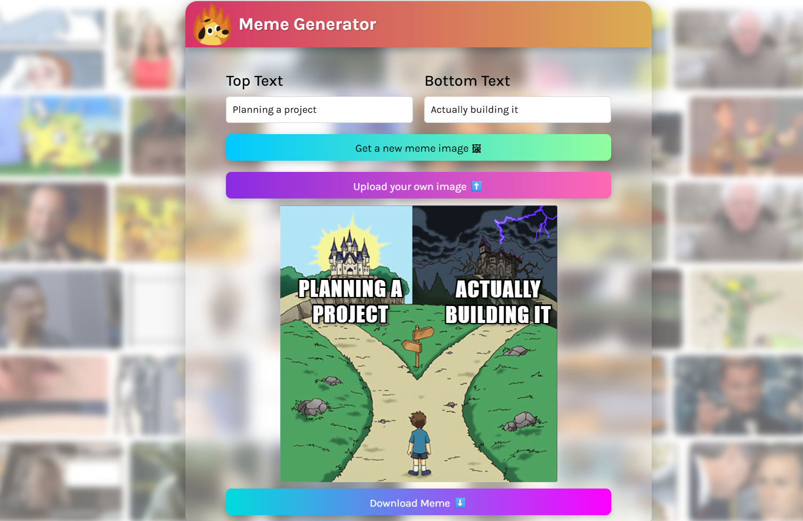

# Vite Memes 🎭🔥

A fun and interactive React app that lets you generate random meme images, add custom top/bottom text, and drag them around to position them just right. Built for laughs — and to sharpen those front-end skills!

## ✨ Features
- 🖼️ Get a random meme from an external API
- ✍️ Add your own top and bottom text
- 🖐️ Drag text freely to position it on the image
- 📥 Download your meme as an image
- 📸 Upload your own image and use that as meme template
- 📱 Clean, responsive UI with a fun animated vibe

## 🌐 Live Demo
Check out the live version [here.](vite-memes.netlify.app)





## 💻 Tech Stack
- React + Vite ⚡
- JavaScript
- HTML/CSS
- [react-draggable](https://www.npmjs.com/package/react-draggable)

## 🖼️ API Used

Images are fetched from the free [Imgflip Meme API](https://api.imgflip.com/get_memes) — no API key needed!

## 📦 Installation

```bash
git clone https://github.com/your-username/vite-memes.git
cd vite-memes
npm install
npm run dev
```

## 🙇 Final Words
Thanks for checking out **Vite Memes**!  
I build this project for fun and learning React. Feel free to explore.  
Happy memeing! 🎉